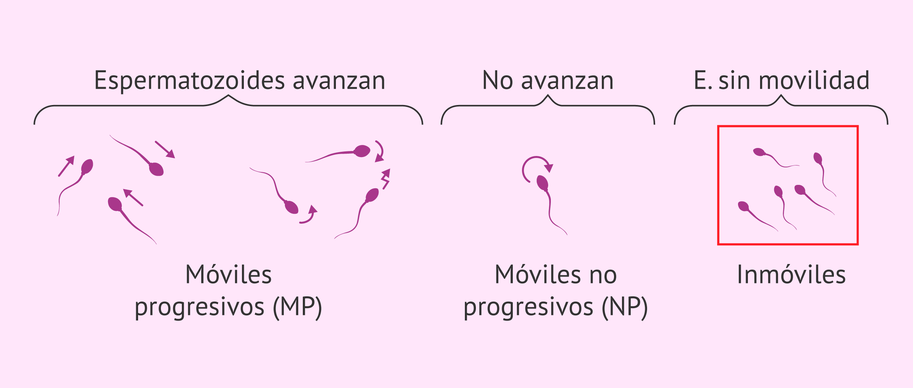

# DeepSpermMotility



## Introduction
DeepSpermMotility is a project that analyzes sperm motility from videos using deep learning and computer vision techniques. It automates the process of tracking sperm and classifying their movement patterns.

## ✨ Features
*   **Sperm detection and tracking:** Utilizes YOLOv5 for detecting sperm and SORT (Simple Online and Realtime Tracking) for tracking them across video frames.
*   **Calculation of various motility parameters:** Computes key sperm motility metrics such as:
    *   VCL (Curvilinear Velocity)
    *   VSL (Straight-Line Velocity)
    *   VAP (Average Path Velocity)
    *   LIN (Linearity: VSL/VCL)
    *   STR (Straightness: VSL/VAP)
    *   WOB (Wobble: VAP/VCL)
    *   ALH (Amplitude of Lateral Head Displacement)
    *   BCF (Beat Cross Frequency)
*   **Classification of sperm motility:** Classifies sperm into categories (e.g., progressive, hyperactive, immotile) using a pre-trained XGBoost model.
*   **GUI for easy video processing and visualization:** Provides a user-friendly graphical interface to load videos, initiate processing, and view results.
*   **Outputs detailed tracking and feature data:** Generates CSV files containing comprehensive tracking information and calculated motility parameters for each sperm.

## ⚙️ Workflow
1.  **Video Input:** The user selects a video file through the GUI or specifies the path in the command-line script.
2.  **Sperm Detection:** Each frame of the video is processed by the YOLOv5 model to detect the location of sperm heads.
3.  **Sperm Tracking:** The SORT algorithm is applied to the detected sperm across frames to maintain unique identities for each sperm and record their trajectories.
4.  **Parameter Calculation:** Based on the recorded trajectories, various motility parameters (VCL, VSL, VAP, LIN, etc.) are calculated for each tracked sperm.
5.  **Motility Classification:** The calculated motility parameters are fed into a pre-trained XGBoost model, which classifies each sperm's motility type.
6.  **Output Generation:** The system saves the tracking data, calculated features, and velocity information into CSV files. Processed videos showing tracking may also be generated.

## Folder Structure
*   `src/`: Contains all the Python source code for the application, including the GUI, detection, tracking, feature calculation, and classification logic.
*   `models/`: Stores pre-trained machine learning models. This includes the XGBoost classifier for motility.
*   `results/`: Default output directory where CSV files with tracking data, motility features, and processed video data are saved.
*   `data/`: (Implicit) Expected location for input video data. Scripts might reference paths like `../data/VISEM_Tracking/`. Users should place their raw video files here.
*   `YOLO_model/`: (Implicit) Expected location for the YOLOv5 model weights file.

## 🛠️ Setup and Installation
1.  **Python:** Python 3.x is recommended.
2.  **Dependencies:** Install the required Python packages using pip:
    ```bash
    pip install -r requirements.txt
    ```
3.  **YOLOv5 Model:**
    *   Download the YOLOv5 model weights file, specifically `best_yolov5x.pt`. This model is often used for object detection and might have been fine-tuned for sperm detection in this project.
    *   You can typically find YOLOv5 models on the Ultralytics GitHub repository releases page (e.g., `https://github.com/ultralytics/yolov5/releases`). You may need to search for the specific `best_yolov5x.pt` or a suitable generic version like `yolov5x.pt`.
    *   Create a directory named `YOLO_model/` in the root of the project.
    *   Place the downloaded `.pt` file into the `YOLO_model/` directory.
4.  **Pre-trained Classifier:** The pre-trained XGBoost model for motility classification is included in the `models/` directory.

## ▶️ How to Run

### Using the GUI
1.  Ensure all dependencies and models are set up correctly.
2.  Navigate to the project's root directory in your terminal.
3.  Run the application using the following command:
    ```bash
    python src/app.py
    ```
4.  In the GUI:
    *   Click "Select Video" to choose the video file you want to analyze.
    *   Enter a "Test Name" which will be used for naming the output folder.
    *   Click "Start Process" to begin the analysis.

### Using the Command Line Interface (CLI)
For more advanced users or batch processing, you can run the main processing script directly:
1.  Ensure all dependencies and models are set up correctly.
2.  Open the `src/sperm_video_classify.py` script in a text editor.
3.  Locate the `if __name__ == "__main__":` block at the end of the file.
4.  Modify the `video_path` variable to the absolute or relative path of your input video.
5.  Modify the `name_video` variable to a desired name for your test (this will influence output file naming).
6.  Save the changes to the script.
7.  Run the script from your terminal:
    ```bash
    python src/sperm_video_classify.py
    ```

## 📄 Output
The application generates the following output files, typically saved in a subdirectory within `results/` named after the `name_video` or test name provided:
*   `tracking_sperm.csv`: Contains the raw tracking data for each sperm, including frame number, sperm ID, and bounding box coordinates.
*   `features_sperm.csv`: Lists the calculated motility parameters for each tracked sperm.
*   `velocity_sperm.csv`: Contains detailed velocity information for each sperm.
*   Processed videos (optional): The system might also output videos with tracking visualizations.

## Dependencies
All required Python packages are listed in the `requirements.txt` file.

## Contributing
Contributions are welcome. Please open an issue to discuss your ideas or submit a pull request with your changes.

## License
This project is currently unlicensed.